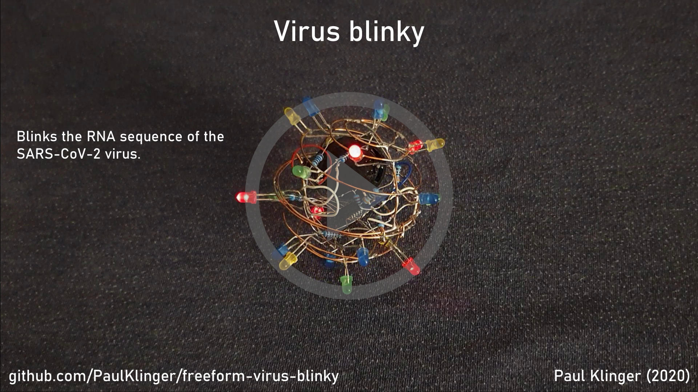

# Virus Blinky

Freeform electronics thingy vaguely shaped like a SARS-CoV-2 virus blinking out the virus's RNA sequence.

The main body consists of 0.6mm copper wire shaped into circles and soldered together. There's a makeshift hinge on one side so the ball can be opened to change the battery and reprogram the MCU.

Current draw is between 1-5mA depending on which color LEDs are active at the moment (the blue ones are a lot more efficient than the green ones), which should last over a day of continuous use on a CR2032 coin cell.

### Components:

- ATtiny1614 MCU
- 47uF 1206 capacitor
- [SMD slide switch](https://www.aliexpress.com/item/32967873133.html)
- [CR2032 Coin cell holder](https://www.aliexpress.com/item/10PCS-Battery-Button-Cell-Holder-Socket-Case-CR2032-battery-holder-2032/32819924096.html)
- 0.6mm copper wire (maybe 20cm at most)
- 7 x blue 3mm LED
- 5 x green 3mm LED
- 5 x yellow 3mm LED
- 5 x red 3mm LED
- some 30AWG wire wrapping wire (used to connect the two halves together as it is more flexible than the resistor leads)
